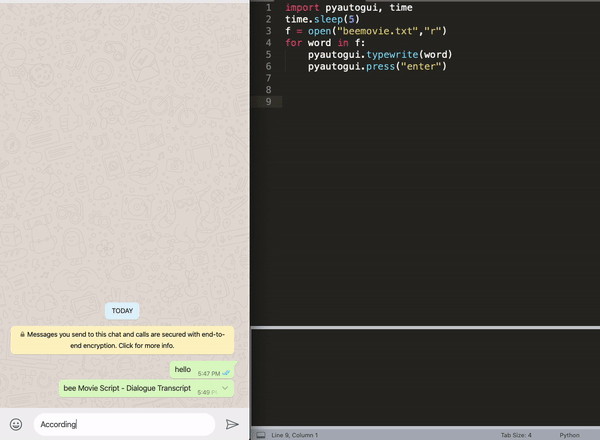

# Spam-Bot
A spam bot which can bombard with messages anywhere 😈 . Use with caution. (It prints out all dialogues of beemovie, but you can change that to any file in the script)

## Working:



## Steps:
1.  First run the following command to install pyautogui library dependency:
```bash
pip3 install pyautogui
```
2. Run the python script in your IDE or in terminal with:
```bash
python spambot.py
```
*NOTE*: The python script will start throwing messages in 5 seconds, so switch to the application which you want to spam in under 5 seconds.

### To stop the program just press ctrl+c in your IDE or terminal where the script was running
